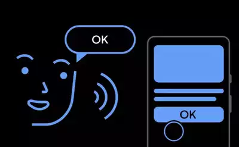
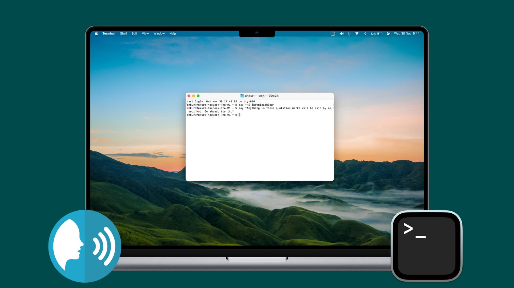

# Quorra - AI Assistant
Quorra is a voice-activated AI assistant built with Python that can respond to a variety of commands, perform tasks, and engage in natural conversations using 
OpenAI model. It can browse websites, open apps, provide the time, and more.

### Features

  

   - Voice Commands: Use voice commands to interact with Quorra and control applications.
   
### OpenAI Integration: 
  - Quorra to handle natural language queries and respond intelligently.
  
### Automated File Creation: 
  - Create new Python files and open them directly in Visual Studio Code with a voice command.
  
### Open Websites and Apps:
  - Quorra can quickly open frequently used websites and applications.
  
### Time Information: 
  - Get the current time through a voice command.
  
### System Commands: 
 - Lock the screen, check battery status, or even put the system into sleep mode with a voice command.
  
### Music Playback:
 - Play your favorite music directly from your device.
  
### Bluetooth and Siri: 
 - Open Bluetooth settings or activate Siri directly via Quorra.
  
### Chat Reset:
 - You can reset the chat history at any time for a fresh conversation.
  
### Requirements
 - Python 3.x
 - OpenAI API Key (replace YOUR_API_KEY with your actual key)
  
### Packages:
 - speech_recognition
 - openai
 - webbrowser
 - os
 - subprocess
### Installation

 - Clone this repository to your local machine.

  - Install the necessary Python packages:
   
### bash
    Copy code
    pip install speechrecognition openai
    Replace YOUR_API_KEY with your actual OpenAI API key in the script.

    Ensure you have a working microphone for speech input.
### Usage
    Run the script to activate Quorra. You can interact with it through voice commands. Some example commands include:

    "Open YouTube"
    "What time is it?"
    "Create a file"
    "Run the AI with the prompt"
    Quorra will handle your request and provide feedback using text-to-speech output.

### Customization
    You can customize Quorra to your needs by:

    Adding more frequently used websites or applications in the sites list.
    Customizing paths for files or applications that Quorra should open.
### Contributing
    Feel free to contribute to this project by opening issues or submitting pull requests.

  

